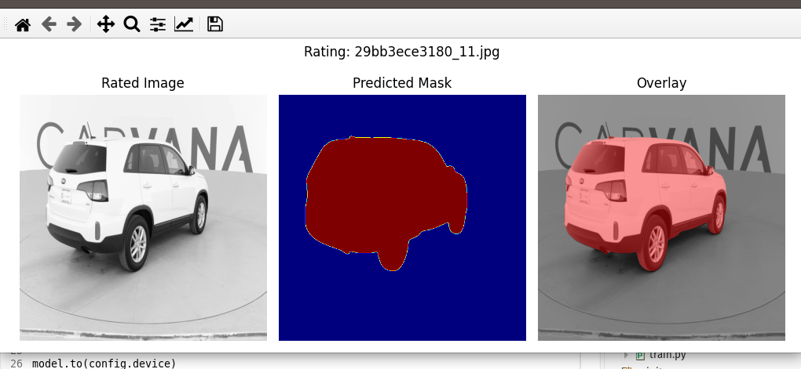
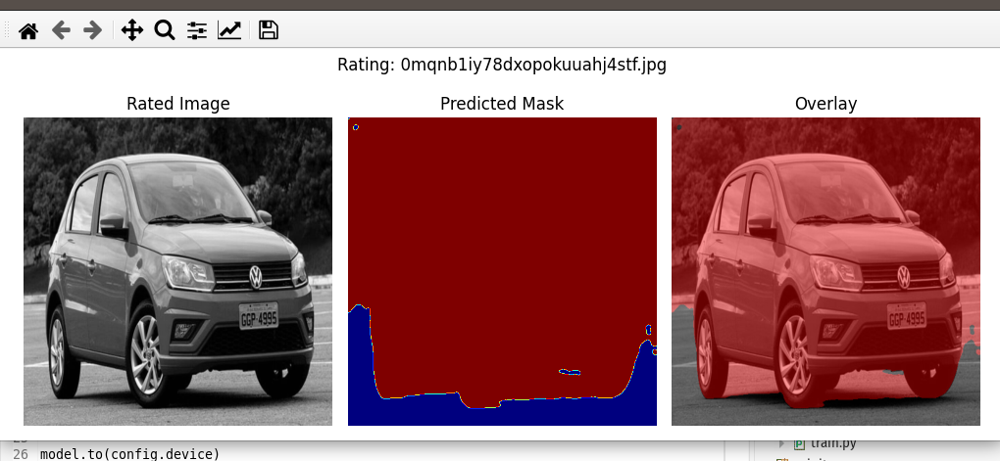
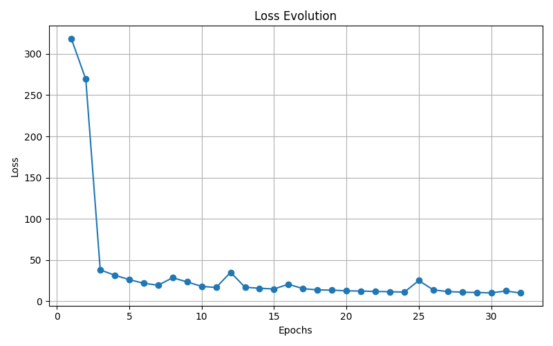
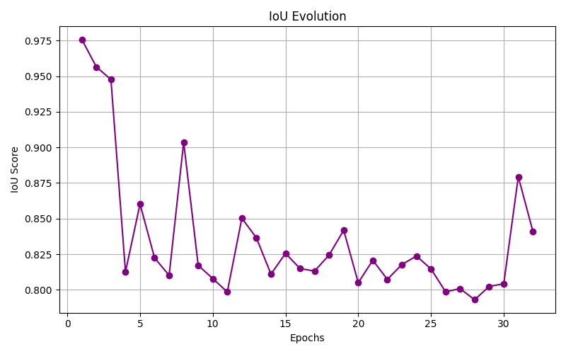
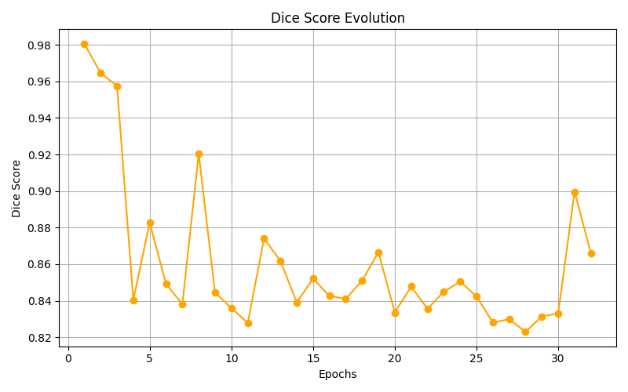

# Image Segmentation with ResNet + U-Net

💡 ResNet + U-NET fusion combines deep and contextual vision (ResNet) with spatial fidelity and accuracy in the details (U-NET). 
It is a versatile, powerful and high sensitivity architecture - ideal for projects where each pixel matters. 
The model shines in scenarios where the object is small, detailed or textured, and the global context (whole scene) does not help much. 
This makes it ideal for: 
	- Medical segmentation (eg tumors, vessels) 
	- Industrial defect inspection
	- Embedded vision for robotics or quality control 
⚠️ However, this current version was trained on a **narrow-domain dataset**, collected under controlled indoor conditions — consistent lighting, high-contrast backgrounds, and fixed camera angles. As a result, its ability to generalize to open-world scenarios (e.g., outdoor images, different backgrounds) is limited.  
**This is not a flaw of the model**, but a **natural reflection of its training data**. When retrained with more diverse and realistic datasets, this architecture has strong potential for robust performance in general-purpose segmentation tasks.


## 📌 Class Convention
This project follows the standard:

- Class 0: Background
- Class 1: Segmented Object

All masks were converted to reflect this convention before training.

## 🌐 Limitations and Considerations
This model was trained with images captured in a highly controlled environment: constant lighting, a clean background, and objects (cars) positioned on a rotating platform.

As a result, it achieves very high accuracy (IoU > 99%) when evaluated on images similar to those in the original dataset. However, its performance deteriorates significantly when exposed to images collected outdoors, with variations in light, angle, background, and perspective.

This limitation was expected and will be taken into account for future versions with more diverse datasets.

Good Image..
 "good_image.png: Segmentation under ideal studio lighting"

Bad Image..
 "Failure example with open-world street background"


## 🌟 Objective

To segment objects in custom grayscale images based on manual annotations, using a complete training pipeline, automated inference, and visual mask validation.

## 🤖 Notes on Development

This project was born after many hours of experimentation, learning and progress driven by caffeine.
Unlike other projects I have participated in before, this one evolved incredibly quickly thanks to the support of artificial intelligence such as Copilot (Microsoft) and ChatGPT (OpenAI). Without a doubt, these are tools that are way ahead of their time.
As part of the experience of using and learning from these advanced AI tools, I always threw problems at both of them, to measure their performance and compare their responses. And to make the experience more fun, I kept an extremely formal dialogue with one and not at all formal with the other to see how they would react. And after a while, I reversed it, now being informal with the one that was previously formal and vice versa.
Big thanks to both copilots — one named Microsoft, the other simply GPT.
- Powered by: PyTorch, Gradio, OpenCV, Matplotlib, and Hugging Face Datasets


## 📁 Project Structure
.
├── run_app.py
├── bad_image.png
├── CHANGELOG.md
├── checkpoints
│   ├── best_model.pt
│   └── modelo_completo.pth
├── DataSet
│   ├── annotations
│   │   └── classes.txt
│   ├── ExtraTests
│   ├── images
│   └── masks
├── dice_history.png
├── run_evaluate.py
├── good_image.png
├── __init__.py
├── iou_history.png
├── LICENSE
├── model_card.md
├── .huggingface
│   └── model-index.yaml
├── README.md
├── report_file.txt
├── requirements.txt
├── scripts
│   ├── config.py
│   ├── Dataset
│   │   ├── ConvertFormat.py
│   │   ├── dataAugmentation.py
│   │   ├── deleteDuplicates.py
│   │   ├── getDS_HuggingFace.py
│   │   ├── getImages.py
│   │   ├── grays.py
│   │   ├── __init__.py
│   │   ├── mask_diagnosis.py
│   │   ├── masks.py
│   │   ├── Rename.py
│   │   ├── Resize.py
│   │   ├── TrainVal.py
│   │   └── validMasks.py
│   ├── __init__.py
│   └── Segmentation
│       ├── app.py
│       ├── augment.py
│       ├── diceLossCriterion.py
│       ├── evaluate_model.py
│       ├── flagged
│       ├── focalLoss.py
│       ├── Future
│       ├── __init__.py
│       ├── models.py
│       ├── segDS.py
│       └── train.py
├── structure.txt
├── training_loss.png
└── training_val_accuracy.png

### 📁 Root Directory
| Name                     | Description                                                                 |
|--------------------------|-----------------------------------------------------------------------------|
| `run_app.py`             | Launcher script — possibly for local inference or interface                 |
| `bad_image.png`          | Example of a failed prediction (for benchmarking or documentation)          |
| `good_image.png`         | Example of a successful prediction (used for showcasing model quality)      |
| `CHANGELOG.md`           | History of changes and version updates                                      |
| `checkpoints/`           | Contains trained model files (`best_model.pt`, `modelo_completo.pth`)       |
| `DataSet/`               | Contains training images, masks, annotations, and extra test sets           |
| `dice_history.png`       | Visualization of Dice score progression during training                     |
| `iou_history.png`        | Graph of Intersection over Union (IoU) evolution across epochs              |
| `training_loss.png`      | Plot showing model loss evolution throughout training                       |
| `training_val_accuracy.png` | Graph of validation accuracy during model training                       |
| `run_evaluate.py`        | Evaluation script runnable from root — assesses model performance           |
| `__init__.py`            | Declares root as a Python package (if imported externally)                  |
| `LICENSE`                | Legal terms for usage and redistribution                                    |
| `model_card.md`          | Technical summary of model details, performance, and intended use           |
| `.huggingface/model-index.yaml` | Configuration file for Hugging Face model registry (optional export) |
| `README.md`              | Main documentation file — project overview, usage, and setup guide          |
| `report_file.txt`        | Training log and report output saved during execution                       |
| `requirements.txt`       | List of dependencies needed for running the project                         |
| `scripts/`               | Main logic for training, evaluation, dataset preparation, and modeling      |
| `structure.txt`          | Manual export of the folder structure, used as reference or debug aid       |

### 📁 DataSet/
| Name              | Description                                                                     |
|-------------------|---------------------------------------------------------------------------------|
| `annotations/`    | Contains `classes.txt`, defining class labels used in segmentation              |
| `images/`         | Input images used for training and evaluation                                   |
| `masks/`          | Segmentation masks aligned with input images                                    |
| `ExtraTests/`     | Optional dataset with additional test cases for generalization assessment       |

### 📁 scripts/
| Name                 | Description                                                                   |
|----------------------|-------------------------------------------------------------------------------|
| `config.py`          | Configuration module holding paths, flags, and hyperparameters                |
| `__init__.py`        | Declares `scripts/` as an importable Python module                            |


### 📁 scripts/Dataset/
| Name                   | Description                                                                 |
|------------------------|-----------------------------------------------------------------------------|
| `ConvertFormat.py`     | Converts image or annotation formats (e.g. from JPG to PNG, or COCO to mask)|
| `dataAugmentation.py`  | Applies offline augmentations to images or masks                            |
| `deleteDuplicates.py`  | Detects and removes duplicate samples                                       |
| `getDS_HuggingFace.py` | Downloads datasets from Hugging Face 🤗                                     |
| `getImages.py`         | Image retrieval or organization from storage                                |
| `grays.py`             | Converts images to grayscale                                                |
| `mask_diagnosis.py`    | Validates and diagnoses potential issues in masks                           |
| `masks.py`             | Performs manipulation or binarization of segmentation masks                 |
| `Rename.py`            | Batch renaming utility to standardize filenames                             |
| `Resize.py`            | Resizes images and masks to uniform dimensions                              |
| `TrainVal.py`          | Performs dataset train/validation splitting                                 |
| `validMasks.py`        | Checks for validity in mask formatting and values                           |
| `__init__.py`          | Declares `Dataset/` as a Python package                                     |


### 📁 scripts/Segmentation/
| Name                   | Description                                                                 |
|------------------------|-----------------------------------------------------------------------------|
| `app.py`               | Local interface for model inference — CLI or GUI                            |
| `augment.py`           | Online augmentations and Test-Time Augmentation (TTA)                       |
| `diceLossCriterion.py` | Custom Dice Loss implementation for segmentation                            |
| `focalLoss.py`         | Custom Focal Loss implementation to handle class imbalance                  |
| `evaluate_model.py`    | Model evaluator with metrics like IoU, Dice, and pixel accuracy             |
| `models.py`            | Contains neural network architecture (e.g. UNet based on ResNet)            |
| `segDS.py`             | Dataset class for segmentation tasks, loading images and masks              |
| `train.py`             | Main training script with logging, plotting, checkpointing, and early stop  |
| `Future/`              | Experimental code including auto hyperparameter tuning                      |
| `flagged/`             | Optional output folder for flagged evaluations or debug samples             |
| `__init__.py`          | Declares `Segmentation/` as a Python package                                |

## Dataset
This project uses data from the [CV Image Segmentation Dataset](https://www.kaggle.com/datasets/antoreepjana/cv-image-segmentation), which provides paired images and masks for semantic segmentation tasks.
The Dataset presents some distinct data subsets.
I only used the images related to carvana cars (Kaggle Carvana Car Mask Segmentation). This was the dataset used to test the project ...

The data subset used as the dataset for the project was pre-processed with the following order of scripts present in this project:
 1 - Run getImages.py #Or use other data sources.
 2 - Visually inspect the collected images.
 3 - Run deleteDuplicates.py
 4 - Run ConvertFormat.py
 5 - Run Resize.py (Must be run for both the image and mask directories).
 6 - Run grays.py (Must be run for both the image and mask directories).
 8 - Make annotations.
 9 - Run masks.py
10 - Run validMasks.py
11 - Run TrainVal.py

---

## ⚙️ Model

* Architecture: ResNet encoder + U-Net decoder
* Input: 1-channel grayscale, resized to 512×512
* Loss: Cross Entropy Loss with class weighting
* Optimizer: Adam
* Scheduler: StepLR with decay
* Training duration: configurable (default: 400 epochs)
* Early Stopping: based on accuracy stagnation
* Checkpoints: saved every N epochs + best model saved

Training script: `scripts/Segmentation/train.py`
Evaluation scripts:

* `scripts/Segmentation/evaluate_model.py`: Batch evaluation over image folders
* `scripts/Segmentation/app.py`: Gradio demo for interactive inference

* `run_app.py`: Wrapper script to launch the Gradio interface from the root directory (calls scripts/Segmentation/app.py internally)
* `run_evaluate.py`: wrapper script to launch the general pre-testing script from the root directory (calls scripts/Segmentation/evaluate_model.py internally)
📄 The model is documented and registered via model-index.yaml for proper listing on Hugging Face Hub.

---

## 📈 Evaluation

Quantitative metrics include:

* Intersection over Union (IoU)
* Dice coefficient
* Accuracy, Precision, Recall
* Balanced Accuracy and MCC

Visual inspection is supported via overlay masks in the ExtraTests/ folder.








---

## 🔬 Future Work

The directory `scripts/Segmentation/Future/` includes planned extensions for embedded deployment:

* `train_embedded_explicit_model.py`: A simplified and modular training script for generating lightweight ONNX models.
  Note: This script was not executed or validated during this certification phase.

---

## 🏗 Deployment Options

This project includes two scripts for model evaluation:

### 🧪 Batch Evaluation Script (`evaluate_model.py`)

Use this script to run the model on an entire directory of test images. Ideal for debugging, validation, and quantitative analysis.

```bash
python evaluate_model.py --input ./your-test-images/
```

You can modify this script to save prediction masks, compute metrics (IoU, pixel accuracy), or visualize results in batch.

---

### 🌐 Interactive Web Demo (`app.py`)

This script provides an interactive interface using [Gradio](https://www.gradio.app/). It's designed for easy deployment and model demonstration, such as on Hugging Face Spaces.

To launch the web app locally:

```bash
python app.py
```

Or try it online (if hosted):

👉 [Live demo on Hugging Face Spaces](https://huggingface.co/spaces/seu-usuario/seu-modelo) *TODO:(link será atualizado após submissão)*


This interface allows anyone to upload an image and instantly see the segmentation results — no installation required.

---

📌 **Tip**: Use `evaluate_model.py` during development and testing, and `app.py` for sharing and showcasing your model.

---

## 🏆 Certification Context

This repository was submitted for the Hugging Face Computer Vision Certification and is built upon reproducibility, modularity, dataset transparency, and technical rigor.

---

## 📄 License

This project is licensed under the MIT License.
Dataset usage must comply with the original Kaggle dataset license terms.

---

## 🔮 Future improvements

Some steps are already planned for the project's evolution:

* Architecture refinement: test lighter variants (e.g. ResNet18, MobileNetV3) to compare performance in embedded environments.
* Training with data augmentation: use Data Augmentation strategies (rotation, noise, scale, brightness) to increase model robustness.
* Cross-validation: include a cross-validation strategy to increase confidence in metrics.
* Conversion to ONNX/TensorRT: prepare an exportable version of the model for inference on edge devices.
* Deployment on specific hardware: test inference on ESP32-S3 or Raspberry Pi using a simplified pipeline with float16.
* Visualization interface: create a simple script or panel that allows you to upload an image and view the segmentation live.

These improvements will be implemented as the project progresses, keeping the focus on lightness, modularity, and real applicability in computer vision with monochromatic images.

---

## 🌟 Final thoughts: why this certification matters

This project represents more than just completing a technical challenge. For me, it is the fulfillment of a long-held dream — to earn a professional certification that values knowledge, practice, and the ability to solve real-world problems, rather than just familiarity with specific versions of tools or frameworks.

For many years, I experienced the frustrating side of commercial certifications that felt more like traps than opportunities: exams based on obsolete technologies, questionable application centers, and mechanisms that created more obstacles than recognition. That never represented who I am — or what I am capable of building.

This certification, promoted by Hugging Face, is different. It validates true competencies in machine learning and computer vision based on a real-world project, executed end-to-end. It is a type of recognition that carries technical, ethical, and personal value.

That is why it is not “just another delivery.” It is a turning point.


---

## 🌟 Important notes…

1) The IDE used in the project was Eclipse (https://eclipseide.org/) using the PyDev module (https://www.pydev.org/). In this environment it was necessary to include the project path in PyDev-PYTHONPATH to perfectly recognize the includes of some files, as was the case with config.py.

2) The model is being trained with the "train.py" script.
   However, there is a second training script called "cyber_train.py."
   This is an empirical test I'm conducting. A little research of my own.
   In "train," the hyperparameters are chosen manually.
   In "cyber_train," the script will run 25 short training sessions, each lasting 5 epochs, to test the hyperparameters within the established limits and determine the best ones. Then, the actual training will be performed using the best hyperparameters detected.
   And where does my empirical research come in?
   I'm training first with the simplest version of the script, measuring how long it takes me to arrive at a model with a good accuracy percentage.
   Once this is done, I'll run the automated version...
   Then, I'll compare which of the two models performed better and how long it took me to achieve each one...
   This will serve as a reference for more accurate trade-offs in future projects.
